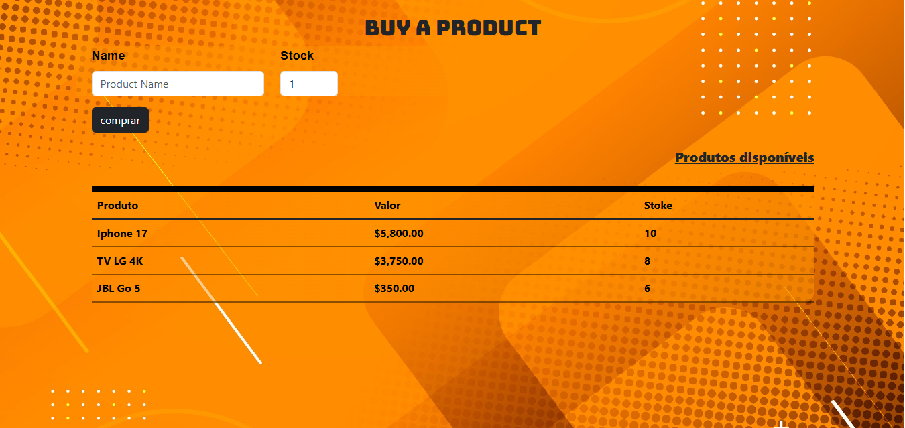
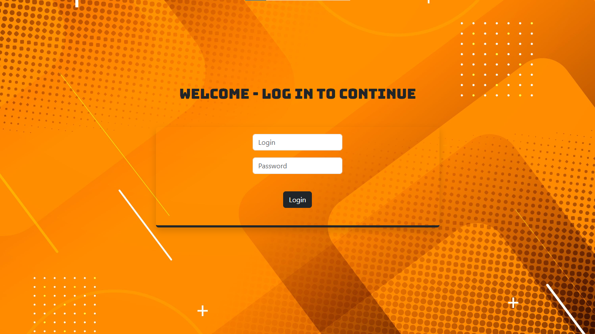
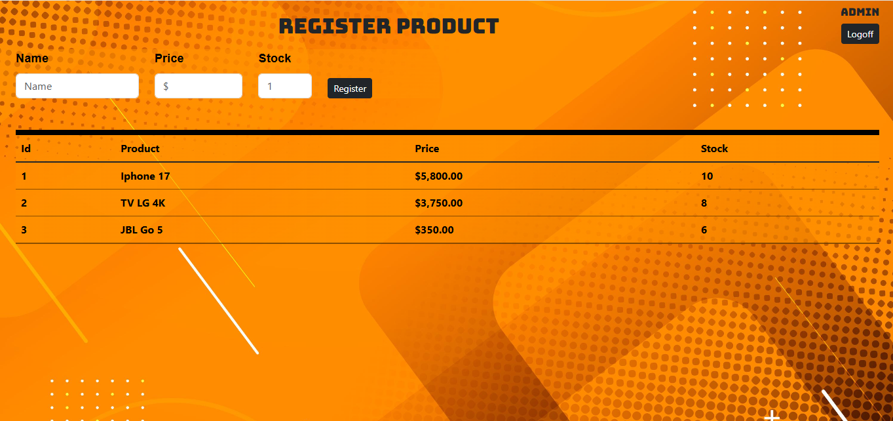
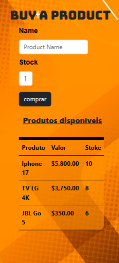
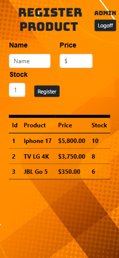

# 🛒 Duct & Product - Sistema de Gerenciamento de Vendas de Produtos

## 🚀 Sobre o Projeto

**Duct & Product** é uma aplicação Full Stack desenvolvida para simular um ambiente real de vendas de produtos, combinando um frontend moderno em React com um backend robusto em Spring Boot.

A plataforma permite o cadastro de produtos, gerenciamento de estoque, compra de produtos, geração de notas fiscais e controle de acesso administrativo através de uma área restrita.

O projeto foi construído com foco em organização de código, APIs REST, implementação de regras de negócio e integração entre aplicações frontend e backend.

---

# 🎯 Principais Funcionalidades

### 👨‍💼 Área Administrativa

- Sistema de login
- Área restrita para gerenciamento
- Cadastro de produtos
- Atualização de estoque
- Visualização de produtos cadastrados

### 📦 Gerenciamento de Produtos

- Cadastro de produtos
- Atualização automática de estoque ao cadastrar um produto já existente
- Atualização de preço
- Controle de inventário
- Listagem de produtos via API REST

### 🛒 Sistema de Compras

- Fluxo de compra de produtos
- Validação de quantidade
- Validação de estoque disponível
- Baixa automática no estoque
- Geração automática de nota fiscal
- Cálculo automático do valor total da compra

### 🧾 Gerenciamento de Notas Fiscais

- Criação de notas fiscais
- Associação de produtos às notas
- Cálculo do valor total
- Persistência dos dados da compra

### 🌐 Página Inicial Institucional

A aplicação também possui uma página inicial responsiva simulando um site comercial, apresentando produtos e direcionando os usuários para a área de compras.

---

# 🏗️ Arquitetura

O backend segue uma arquitetura em camadas:

```text
Controller Layer
        ↓
Service Layer
        ↓
Repository Layer
        ↓
Database
```

### 📁 Controllers

Responsáveis por:

- Expor endpoints REST
- Receber requisições
- Retornar respostas

Controllers implementados:

- ProductController
- InvoiceController
- LoginController

### 📁 Services

Responsáveis por:

- Regras de negócio
- Processamento de compras
- Controle de estoque
- Geração de notas fiscais

Services implementados:

- ProductService
- InvoiceService
- ItemProductService

### 📁 Repositories

Responsáveis por:

- Persistência dos dados
- Acesso ao banco através do Spring Data JPA

Repositories implementados:

- ProductRepository
- InvoiceRepository
- ItemProductRepository

---

# 🧠 Regras de Negócio

O sistema implementa diversas regras para garantir consistência dos dados.

## 📦 Cadastro de Produtos

Quando um produto com o mesmo nome já existe:

- O estoque é somado
- O preço é atualizado
- Um novo registro não é criado

Exemplo:

```java
if(existingProduct.isPresent()) {
    p.setEstoque(
        p.getEstoque() + product.getEstoque()
    );

    p.setPrice(product.getPrice());
}
```

---

## 🛒 Validação de Compras

O sistema valida:

### Quantidade

```java
if(qtdProductBuyed <= 0)
```

Compras com quantidade inválida não são permitidas.

### Disponibilidade de Estoque

```java
if(product.getEstoque() < qtdProductBuyed)
```

Não é possível vender mais itens do que existem em estoque.

---

## 📉 Atualização Automática do Estoque

Ao finalizar uma compra:

```java
product.setEstoque(
    product.getEstoque() - qtdProductBuyed
);
```

O estoque é reduzido automaticamente.

---

## 💰 Cálculo Automático da Nota Fiscal

Cada item comprado contribui para o valor total da nota:

```java
double totalItem =
    product.getPrice() * qtdProductBuyed;
```

O valor total da nota é atualizado automaticamente.

---

# 🗄️ Modelagem do Banco de Dados

## Product

Armazena:

- Nome do produto
- Preço
- Quantidade em estoque

## Invoice

Armazena:

- Identificador da nota fiscal
- Valor total

## ItemProduct

Entidade associativa responsável por:

- Quantidade comprada
- Referência ao produto
- Referência à nota fiscal

---

# 🔗 Relacionamento Entre Entidades

```text
Invoice
   │
   │ 1:N
   ▼
ItemProduct
   ▲
   │ N:1
   ▼
Product
```

---

# ⚙️ Tecnologias Utilizadas

## Backend

- Java
- Spring Boot
- Spring Web
- Spring Data JPA
- Hibernate
- Maven

## Frontend

- React
- React Router DOM
- Axios
- Bootstrap 5
- JavaScript ES6+

## Banco de Dados

- H2 Database

---

# 🎨 Funcionalidades do Frontend

O frontend foi desenvolvido como uma SPA (Single Page Application).

### Funcionalidades

- Interface responsiva
- Navegação entre páginas
- Consumo de APIs com Axios
- Tela de login
- Painel administrativo
- Formulário de cadastro de produtos
- Tela de compras
- Listagem dinâmica de produtos
- Formatação monetária
- Layout responsivo utilizando Bootstrap

---

# 🔐 Autenticação

A aplicação possui um sistema de login utilizado para proteger a área administrativa.

### Área Restrita

Somente usuários autenticados podem acessar:

- Cadastro de produtos
- Gerenciamento de estoque

Os dados de autenticação são armazenados localmente utilizando:

```javascript
localStorage.setItem("auth", response.data);
```

---

# 📡 Principais Endpoints

## API de Produtos

### Listar Produtos

```http
GET /products
```

### Cadastrar Produto

```http
POST /products
```

---

## API de Compras

### Comprar Produto

```http
POST /invoice/buy
```

Parâmetros:

```text
nameProduct
qtdProductBuyed
```

---

## Autenticação

### Login

```http
POST /login
```

---

# 💡 Diferenciais do Projeto

✅ Aplicação Full Stack

✅ API REST com Spring Boot

✅ SPA em React

✅ Arquitetura em Camadas

✅ Controle de Estoque

✅ Geração de Notas Fiscais

✅ Fluxo Completo de Compras

✅ Implementação de Regras de Negócio

✅ Relacionamentos entre Entidades com JPA

✅ Integração com Banco H2

✅ Interface Responsiva

✅ Integração Completa entre Frontend e Backend

---

# 🚀 Como Executar o Projeto

## Backend

```bash
mvn spring-boot:run
```

Servidor:

```text
http://localhost:8080
```

Console H2:

```text
http://localhost:8080/h2-console
```

---

## Frontend

```bash
npm install
npm start
```

Aplicação:

```text
http://localhost:3000
```

---

# 📸 Screenshots
















---

# 🎓 Objetivos de Aprendizado

Este projeto foi desenvolvido para consolidar conhecimentos em:

- Desenvolvimento Backend com Java
- Ecossistema Spring Boot
- Desenvolvimento de APIs REST
- Desenvolvimento Frontend com React
- JPA/Hibernate
- Modelagem de Banco de Dados
- Arquitetura em Camadas
- Implementação de Regras de Negócio
- Integração entre Frontend e Backend

---

# ⭐ Conclusão

O Duct & Product é uma aplicação Full Stack completa que simula um ambiente real de vendas de produtos, abrangendo gerenciamento de produtos, controle de estoque, fluxo de compras, geração de notas fiscais e controle de acesso administrativo.

O projeto demonstra experiência prática com Java, Spring Boot, React, APIs REST, modelagem relacional e arquitetura de aplicações, conceitos amplamente utilizados em ambientes profissionais de desenvolvimento de software.
